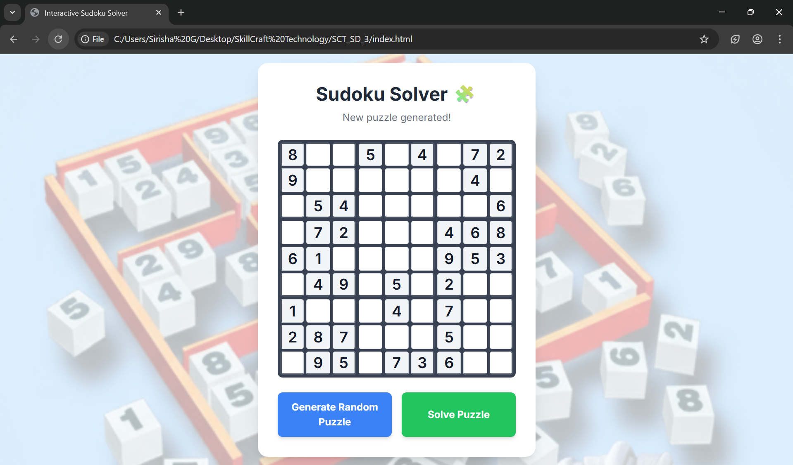
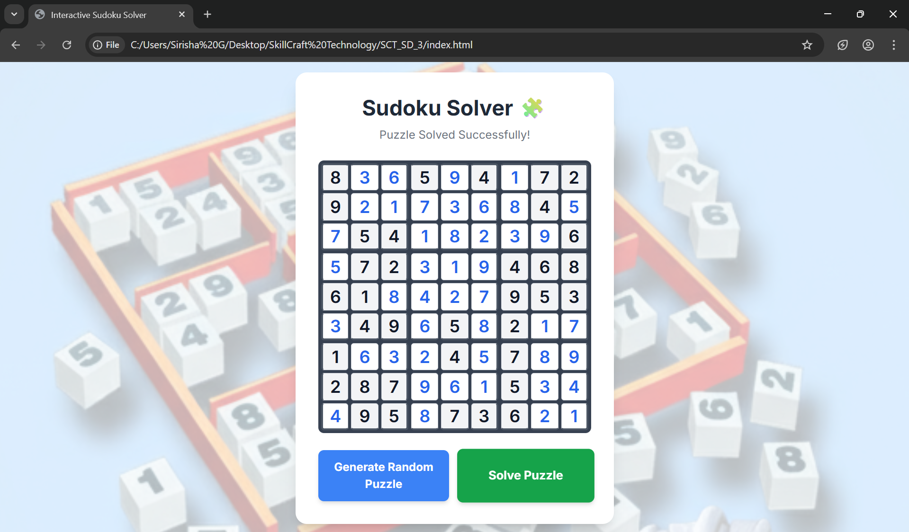

# Sudoku Puzzle Solver 🧩

A visually appealing and interactive Sudoku game where you can generate random puzzles and watch a backtracking algorithm solve them in real-time.

---

## About
This project is a web-based Sudoku solver built with vanilla **HTML, CSS, and JavaScript**.

The user can generate new puzzles with the click of a button, solve them manually, or use the automatic solver to see the solution unfold with a smooth animation.

---

## Features
- **Interactive 9x9 Grid**: Manually enter numbers to solve the puzzle yourself.
- **Random Puzzle Generation**: Create a new, unique Sudoku puzzle anytime.
- **Automatic Solver**: Watch a backtracking algorithm fill in the entire grid automatically.
- **Stylish & Modern UI**: A clean, responsive interface that looks great on any device.
- **Animated Solving**: The solver visualizes its process with a subtle "pop-in" animation for each number.
- **Instant Reset**: Click "Generate Random Puzzle" to clear the board and start a new challenge.

---

## Sudoku Puzzle Solver - Output Screenshots
Here are some sample screenshots of the Sudoku Puzzle Solver project:

*(To add your own screenshots, place them in an `images` folder in your repository and update the paths below)*





---

## Getting Started

### Prerequisites
- A modern web browser (like Chrome, Firefox, Edge, or Safari).
- A text editor (like VS Code) to save the files.

### How to Run

1.  **Clone the repository (or create the files manually):**
    ```bash
    git clone <your-repository-url>
    cd <your-repository-folder>
    ```
    Alternatively, create a new folder and add three files: `index.html`, `style.css`, and `script.js`.

2.  **Add the Code**: Ensure the complete code for each of the three files (`index.html`, `style.css`, `script.js`) is in its respective file.

3.  **Save the Background Image**: Download the background image you want to use, rename it to **`sudoku-bg.png`**, and save it in the same folder as the three files.

4.  **Open in Browser**: Open the `index.html` file directly in your web browser. The game will start immediately.

---

## Usage

-   Click the **Generate Random Puzzle** button to start a new game.
-   To solve manually, click on any empty cell and type a number from 1–9.
-   To see the solution, click the **Solve Puzzle** button.
-   The app will animate the solving process and show the final result. 🎉

---

## License

This project is open source and free to use.

---

## Contact

For questions or feedback, feel free to reach out.

---

✨ Thank you for checking out the Sudoku Puzzle Solver project!
